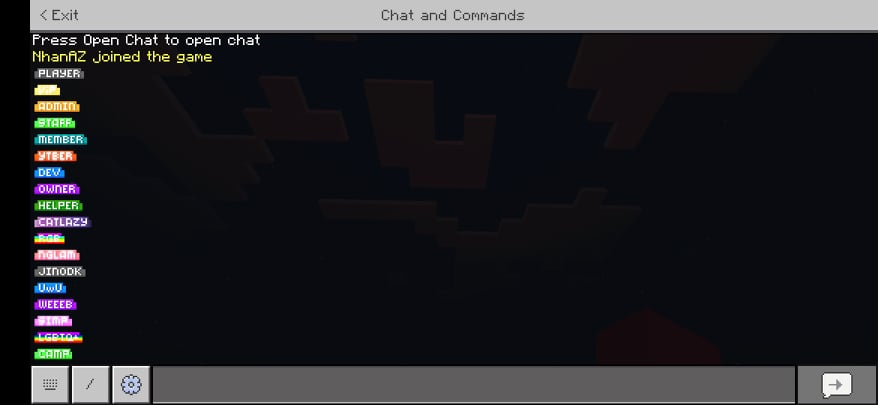

# FI-Symbols
Gói tài nguyên ký tự đặc biệt tùy chỉnh bổ sung được sử dụng trong máy chủ FarmingIsland-JINODK Network.

# Danh sách ký tự
|Tên|Ký tự|Trong trò chơi|
|:-:|:-:|:-:|
|Player|||
|VIP|||
|Admin|||
|Staff|||
|Member|||
|YouTuber|||
|Dev|||
|Owner|||
|Helper|||
|CatLazy|||
|RGB|||
|NgLam|||
|JINODK|||
|UwU|||
|Weeeb|||
|Simp|||
|LGBTQ+|||
|Camp|||

# Tất cả ký tự trong trò chơi


# Cách sử dụng
0. [Lưu ý: Không sài /setformat để setformat được! Vui lòng vào `PocketMine-MP/plugin_data/PureChat/config.yml` để setformat]
1. [Tải về](https://github.com/NhanAZ/FI-Symbols/archive/refs/heads/master.zip) gói tài nguyên
2. Duy chuyển gói tài nguyên và đặt vào thư mục resource_packs (`PocketMine-MP/resource_packs/`)
3. Vào resource_packs.yml (`PocketMine-MP/resource_packs/resource_packs.yml`) và chỉnh thành định dạng như bên dưới:
```yaml
#This configuration file controls global resources used on your PocketMine-MP server.

#Choose whether players must use your chosen resource packs to join the server.
#NOTE: This will do nothing if there are no resource packs in the stack below.
force_resources: true
resource_stack:
  - PMVNG-FI-Symbols-master.zip
  #Resource packs here are applied from bottom to top. This means that resources in higher packs will override those in lower packs.
  #Entries here must indicate the filename of the resource pack.
  #Example
  # - natural.zip
  # - vanilla.zip
  #If you want to force clients to use vanilla resources, you must place a vanilla resource pack in your resources folder and add it to the stack here.

```
4. Sao chép ký tự tương ứng và dán ra để sử dụng.

# Lưu ý
Các ký tự mặc định dưới đây sẽ bị vô hiệu hóa vì trùng lặp với ký tự tùy chỉnh. Cân nhắc trước khi sử dụng! <br/>


# Giấy phép
- Giấy phép [MIT](https://github.com/NhanAZ/FI-Symbols/blob/main/LICENSE)
- Gói tài nguyên gốc tại [JinodkDevTeam](https://github.com/JinodkDevTeam/FI-Symbols)
- Gói tài nguyên bởi [NgLamVN](https://github.com/NgLamVN)
- README bởi [NhanAZ](https://github.com/NhanAZ)
